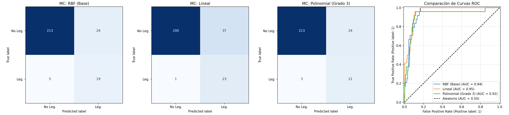

# Clasificación de Pokémon Legendarios con SVM

Este proyecto implementa un modelo de Machine Learning supervisado basado en **Support Vector Machines (SVM)** para predecir si un Pokémon es legendario (`is_legendary`) a partir de sus estadísticas físicas y de combate numéricas.

---

## Procedimiento General del Proyecto

### Fase 1: Carga y Preparación de Datos
1. **Carga del dataset:** Lectura de `pokemon_complete_stats.csv`.
2. **Selección de variables:**
   * **Predictoras ($X$):** 9 características numéricas (`hp`, `attack`, `defense`, `special_attack`, `special_defense`, `speed`, `height_dm`, `weight_hg`, `base_experience`).
   * **Objetivo ($y$):** `is_legendary` (0 = Común, 1 = Legendario).
3. **Limpieza de valores nulos:** Se descartan los 49 Pokémon incompletos en `base_experience` para garantizar datos 100% limpios y sincronizados (1302 registros finales).

### Fase 2: Particionado y Escalado
4. **División Train / Test (80% / 20%):** Con **estratificación** (`stratify=y`) para mantener la proporción de legendarios (~9%) en ambos conjuntos.
5. **Estandarización (`StandardScaler`):** Ajuste (`fit_transform`) exclusivamente en Train y transformación (`transform`) en Test para prevenir fuga de datos (*data leakage*).

### Fase 3: Experimentación y Comparativa de Kernels
Se evalúan 3 configuraciones de kernel, todas con `class_weight='balanced'` debido al desbalance de clases:

| Kernel | Geometría de la Frontera | Falsos Positivos (FP) | Falsos Negativos (FN) | Recall (Legendarios) | F1-Score | Accuracy |
| :--- | :--- | :---: | :---: | :---: | :---: | :---: |
| **RBF (Base)** | Campanas gaussianas locales (espacio de dimensión infinita) | 24 | 5 | 79.2% | 0.567 | 88.9% |
| **Lineal** | Hiperplano plano en el espacio original | 37 | **1** | **95.8%** | 0.548 | 85.4% |
| **Polinomial (Grado 3)** | Curvas suaves por combinaciones multiplicativas de variables | **24** | **3** | **87.5%** | **0.609** | **89.7%** |

---

## Métricas Clave y Conclusiones para la Defensa en Clase

* **¿Por qué no guiarse solo por Accuracy?** Al haber solo un ~9% de Pokémon legendarios, un clasificador ingenuo tendría 91% de exactitud sin predecir ningún legendario.
* **Recall (Sensibilidad):** El **Kernel Lineal** obtiene el valor más alto (**95.8%**, solo 1 falso negativo), ideal si la prioridad absoluta es no perder ningún legendario a costa de falsas alarmas (37 falsos positivos).
* **F1-Score (Balance óptimo):** El **Kernel Polinomial de grado 3** es el **mejor modelo global** con un F1 de **0.609**, reduciendo los falsos negativos a solo 3 y manteniendo bajos los falsos positivos (24).

---

## Visualización Gráfica

El script genera automáticamente el archivo `evaluacion_kernels_comparativa.png` que reúne las matrices de confusión de cada kernel y la comparación directa de sus curvas ROC:



---

## Ejecución del Proyecto

```bash
python3 practicaSVM.py
```
El script mostrará las métricas paso a paso en la terminal, imprimirá la tabla comparativa final y abrirá la visualización gráfica de resultados.
